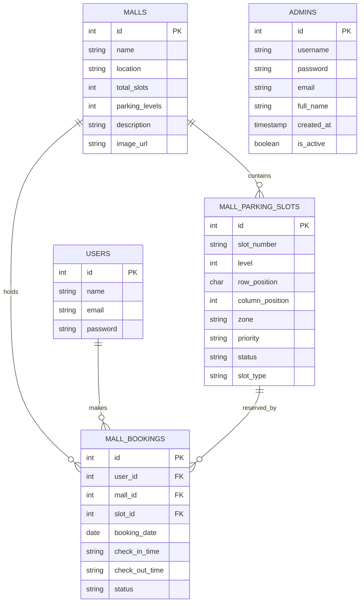

# 🚗 ParkWave - Smart Parking Management System

ParkWave is a premium, state-of-the-art Web Application designed to solve modern urban parking problems for shopping malls. Built with a highly responsive, glassmorphic UI and an optimized Spring Boot + PostgreSQL backend, ParkWave enables users and guests to view real-time floor maps, book slots instantly in advance, and verify tickets seamlessly.

---

## 📌 Project Architecture & Requirements

### 1. The Core Problem
Parking in major shopping malls is notoriously tedious. Drivers spend substantial time hunting for vacant spots, leading to congestion, fuel wastage, and frustration. Existing systems lack real-time visibility, cross-origin compatibility, or responsive mobile designs.

### 2. The Solution Acquired
ParkWave resolves these pain points through:
* **Interactive Floor Maps**: Real-time layout visualizer displaying slot types (Regular, Handicapped, VIP) and status (Available vs Booked).
* **Multi-Mall Coverage**: Support for booking across several malls with multi-level configurations.
* **Unified Auth & Guest Flows**: Supports complete registered user logins alongside frictionless guest slot booking.
* **Ticket Verification Engine**: Provides a unique digital boarding pass view allowing anyone to query and verify tickets instantly using their Booking ID.
* **Responsive Layout**: Designed beautifully for both high-end desktop monitors and specialized mobile viewports using a modern bottom-bar navigation grid.

---

## 💻 Tech Stack

* **Backend**: Java 17, Spring Boot, Spring Data JPA, Hibernate, Spring Security (BCrypt password encoder)
* **Frontend**: HTML5, Vanilla CSS3 (Glassmorphism, floating blur blobs, custom transitions), Vanilla JS (ES6 fetch APIs)
* **Database**: PostgreSQL (Production on Neon DB) / MySQL (Local fallback)
* **Hosting**: Docker, Hugging Face Spaces

---

## 🔑 Database Design

---

## 🔌 API Reference & Endpoints

### 👤 User Endpoints (`/api/users`)

#### 1. Register User
* **Method**: `POST`
* **Path**: `/api/users/register`
* **Payload**: `User` JSON
* **Description**: Signs up a new user, hashes their password using BCrypt, and enforces email uniqueness in the database.

#### 2. User Login
* **Method**: `POST`
* **Path**: `/api/users/login-with-id`
* **Payload**: `LoginRequest` JSON
* **Description**: Validates email and hashes, returning the full authenticated `User` record to set up the browser session.

#### 3. User Logout
* **Method**: `POST`
* **Path**: `/api/users/logout`
* **Description**: Securely logs the user out from the server session.

---

### 🛍️ Mall Endpoints (`/api/malls`)

#### 1. Get All Malls
* **Method**: `GET`
* **Path**: `/api/malls`
* **Description**: Returns all registered malls in the database.

#### 2. Get Random Malls
* **Method**: `GET`
* **Path**: `/api/malls/random`
* **Description**: Returns dynamic, randomized list of malls to serve on the homepage/selection cards.

#### 3. Get Mall By ID
* **Method**: `GET`
* **Path**: `/api/malls/{mallId}`
* **Description**: Retrieves detailed info of a specific mall (levels, location, total slots) to build the active parking maps.

---

### 🅿️ Parking Slot Endpoints (`/api/mall-parking`)

#### 1. Get Slots By Level
* **Method**: `GET`
* **Path**: `/api/mall-parking/slots/{mallId}/level/{level}`
* **Description**: Dynamically pulls active slot records for a specific level of a mall to construct the interactive grid.

---

### 📅 Booking Endpoints (`/api/mall-bookings`)

#### 1. Create User Booking
* **Method**: `POST`
* **Path**: `/api/mall-bookings`
* **Params**: `userId`, `mallId`, `slotId`
* **Description**: Allocates slot, switches status to `BOOKED`, and inserts an `ACTIVE` booking ticket record in the DB.

#### 2. Create Guest Booking
* **Method**: `POST`
* **Path**: `/api/mall-bookings/guest`
* **Params**: `guestName`, `mallId`, `slotId`
* **Description**: frictionless guest slot booking flow (no registration required) that registers slot reservation in PostgreSQL.

#### 3. Verify Ticket By ID
* **Method**: `GET`
* **Path**: `/api/mall-bookings/{bookingId}`
* **Description**: Instantly retrieves a single booking ticket by its unique database ID to present the glowing digital boarding pass.

#### 4. Complete Booking
* **Method**: `POST`
* **Path**: `/api/mall-bookings/complete/{bookingId}`
* **Description**: Releases the slot back to `AVAILABLE` and stamps checkout timestamp on the booking.

#### 5. Cancel Booking
* **Method**: `POST`
* **Path**: `/api/mall-bookings/cancel/{bookingId}`
* **Description**: Cancels booking and instantly frees the parking slot.

---

### 👑 Admin Endpoints (`/api/admin`)

#### 1. Admin Login
* **Method**: `POST`
* **Path**: `/api/admin/login`
* **Params**: `username`, `password`
* **Description**: Authenticates administrator credentials and returns session tokens. Throws validation exceptions if access is invalid.

#### 2. Add New Slot
* **Method**: `POST`
* **Path**: `/api/admin/slots`
* **Payload**: `MallParkingSlot` JSON
* **Description**: Admin creation of new custom parking slots.

#### 3. Delete Slot
* **Method**: `DELETE`
* **Path**: `/api/admin/slots/{slotId}`
* **Description**: Admin deletion of a parking slot.

#### 4. Get Statistics
* **Method**: `GET`
* **Path**: `/api/admin/stats/mall/{mallId}`
* **Description**: Computes total/available slots, occupancy ratios, and active reservation analytics for dashboard reports.
